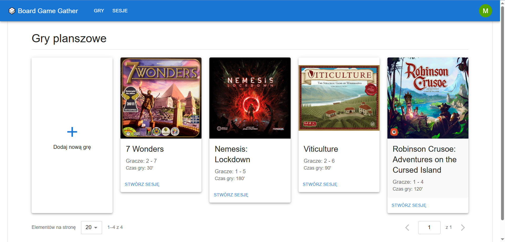
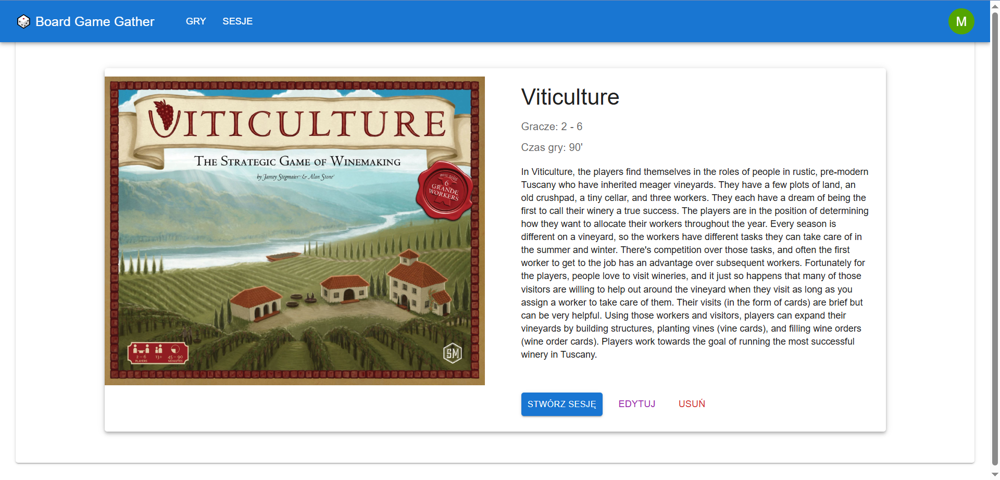
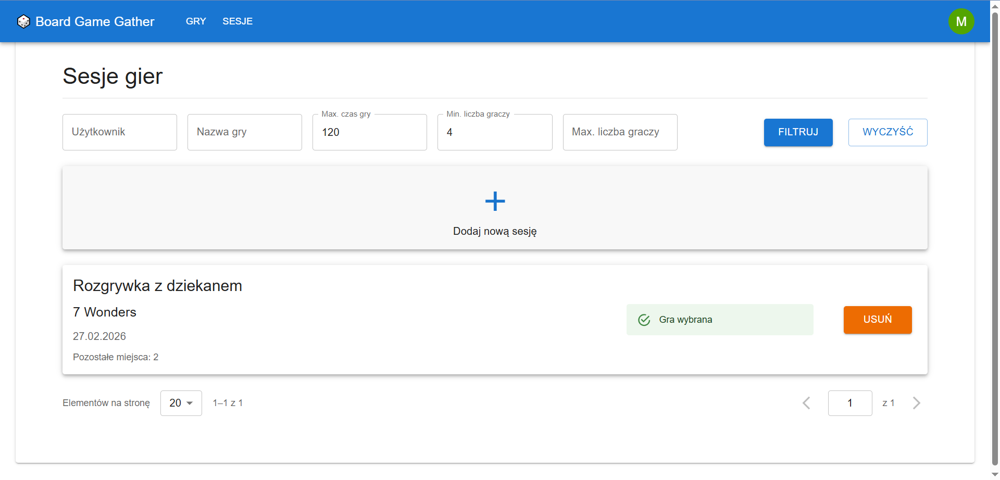
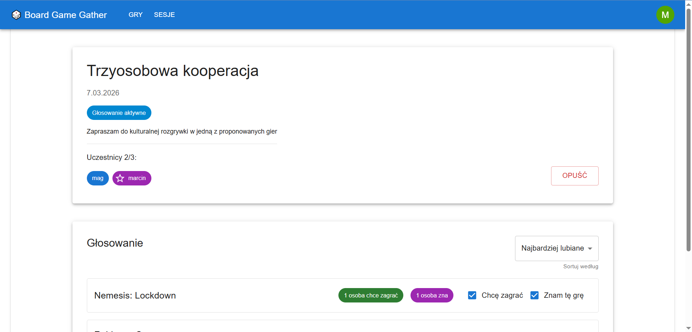

# Board Game Gather
## Overview
Board Game Gather is a web application designed to help users organize board game sessions, manage a shared game catalog, and coordinate play with friends.

The application allows users to create sessions, browse games, vote on what to play, and import board game data from external sources.

---

## Features
### Board Games
 - Listing all available board games
 - Viewing detailed board game information
 - Creating and editing board games 
 - Adding images and rulebooks
 - Importing games by title from BoardGameGeek API
### Game Sessions
 - Creating new sessions with many board games
 - Searching and filtering sessions
 - Voting on preferred games for a session
### Users
 - Basic user authentication via login
 - Resource authorization for basic security

## Screenshots






---

## Technologies
- **Java 25, Spring Boot**
- **React, Typescript, Material UI**
- **PostgreSQL**
- **REST API** architecture
- **Docker, Docker Compose**

## Setup
### Clone the repository

   ```bash
   git clone https://github.com/Kus-Kus16/BoardGameGather
   ```

### Define environmental variables

Create an `.env` file based on `.env.example` with database credentials and external API token.

### Launch Docker stack

   ```bash
   docker compose up
   ```
  
The app will be available at: http://localhost:5173

## Authors
 - Maciej Kus
 - Kamil Życzkowski